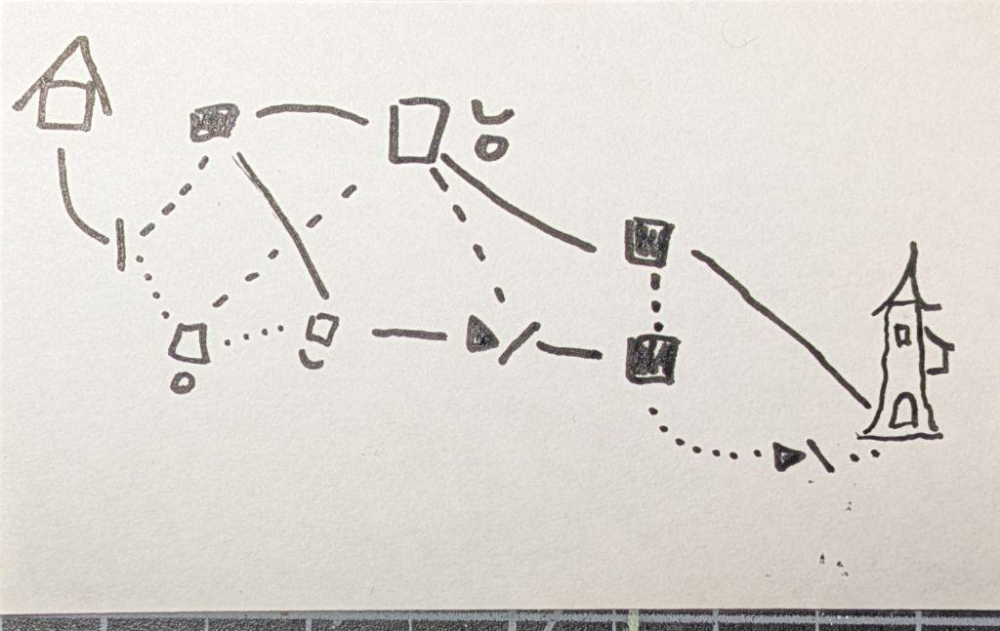
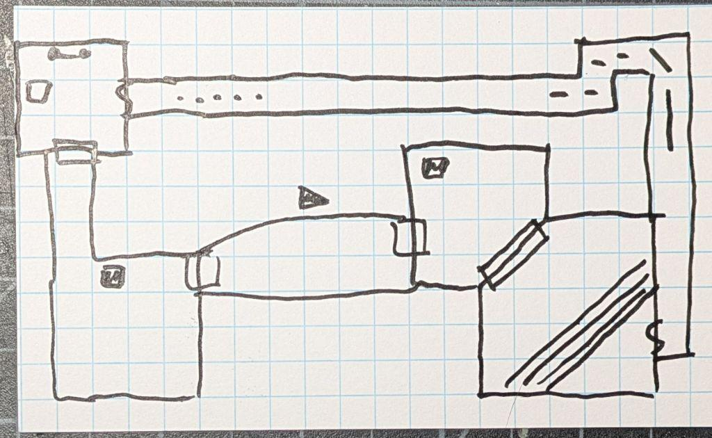

In a recent session a player was talking about how they marked doors and hallways with chalk to leave notes to themselves and the rest of the party. They had split the party, a bold choice.

This got me thinking about [Hobo signs](https://en.wikipedia.org/wiki/Hobo#Hobo_signs_and_graffiti), there are other similar charts and graphics out there. The idea has been repurposed over the years. For example, [Warchalking](https://en.wikipedia.org/wiki/Warchalking) which probably was never a thing, or the often reposted “Burglar Signs” or similar to keep an eye out for, the number of times these are just utility marking signs is amusing. 

Enough digression!

## What Notes Would Dungeon Delvers Leave?

The usefulness of a sign is, at least in part, proportionate to how simple and how universal its meaning is. Signs can be categorized as *directions*, a *heads-up*, or an indicator of *terrain*. They are fuzzy categories with some bleed, like any natural system.

### Directions

* I went this way
* Distance to a landmark, e.g., 20 miles till the city.
* Turn back
* RUN!
* etc.

### Heads-Up

* Safe to camp
* Dirty water
* Clean water
* Food nearby
* Friends
* Danger
* Nothing worth looting.
* Loot ahead
* Basilisk territory
* Traps ahead
* etc.

### Terrain

* Sharp drop
* Slippery
* Tight, need to crawl
* Toxic
* Lava!
* Hard climb
* Easy climb
* etc.

## Using These in a Game

There can be a desire to make an exhaustive list of all the marks and their meaning, in my opinion, counters my goals of providing a diegetic tool.

There is a balance to be struck, where there are enough marks that I, as GM, can use them to communicate to players, while leaving room to have misunderstandings and natural evolution of signs. 

### My List of Dungeon Marks

*Please forgive the limitations of Unicode* 

| Symbol | Meaning |
| :-- | :-- |
| --- | Open path, wide enough to move freely |
| - - - | Tight path, limited movement |
| . . . | Very tight path, need to contort yourself to pass, crawl, etc. | 
| ◀ | Danger this way |
| ◁ | Safety this way |
| ■ | This area is Dangerous |
| □ | This area is safe |
| ◡ | Safe water |
| ◒ | Bad water |
| ● | Food in the area |
| ○ | No food in the area |
| \| | Door, gate, or similar obstacle |
| \ | Incline or decline |

That list is perhaps more exhaustive than I intended, regardless, symbols can be combined ►/ *dangerous cliff this way*. 

The food symbols, my intent was a full plate vs. an empty plate. While shaded symbols usually mean danger, language isn't a logical and clean thing.

## Examples

A map made using Dungeon Marks:

A map annotated with Dungeon Marks:

## Further Ideas

Writing this out naturally leads to more ideas, I can see the start of a caving system here, where you have to make checks to traverse certain terrain or passages. Making longer-distance travel between sections of a megadungeon more gameable.

There is a degree of glee in imagining the players crawling down a tunnel and encountering some hungry denizen of The Below and the chaos that would ensue.
